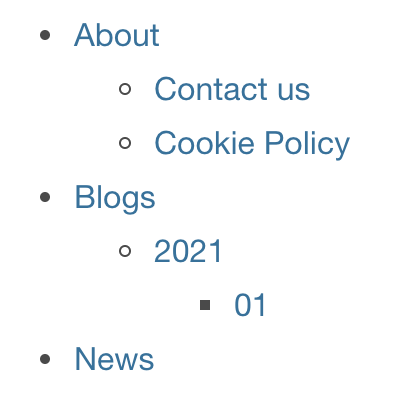

# Sitemap V2
The sitemap v2 plugin is the successor of the original sitemap plugin https://xmdocumentation.bloomreach.com/library/concepts/plugins/sitemap/about.html.

The Sitemap plugin v2 is a delivery tier component that generates an XML feed based on the Sitemap Protocol. This protocol is used by search engines to index your website.
 
# Release Notes  
  
| CMS Version | Plugin Version | Notes                                        |
|-------------|----------------|----------------------------------------------|
| 12.x        | 1.0.6          | Backport for Hippo CMS 12.x                  |
| 14.x        | 2.0.7          | Initial version range                        |
| 15.x        | 3.0.0          | Build with Java 11, rebuild the demo project |

# Installation   

## Add the Forge repository configuration
In the main pom.xml of the project, in the repositories section, add this repository if it is not configured there yet.

    <repository>
      <id>hippo-forge</id>
      <name>Bloomreach Forge Maven 2 repository.</name>
      <url>https://maven.onehippo.com/maven2-forge/</url>
      <snapshots>
        <enabled>false</enabled>
      </snapshots>
      <releases>
        <updatePolicy>never</updatePolicy>
      </releases>
      <layout>default</layout>
    </repository>
    
## Add version property to the project pom

In the root pom.xml of the project, in the properties section, add this property. For the correct version number, check the Release Notes section at the top.
  
     <bloomreach.forge.sitemapv2.version>version.number</bloomreach.forge.sitemapv2.version>   
 
## Maven Dependency

Make sure you have the dependency definition in the root pom.xml of your project:

    <dependencyManagement>
      <dependencies>
     
        <dependency>
          <groupId>org.onehippo.cms7</groupId>    
          <artifactId>hippo-plugin-sitemapv2-component</artifactId> 
          <version>${bloomreach.forge.sitemapv2.version}</version>
        </dependency>
        
        <dependency>
          <groupId>org.onehippo.cms7</groupId>    
          <artifactId>hippo-plugin-sitemapv2-hcm-site</artifactId> 
          <version>${bloomreach.forge.sitemapv2.version}</version>
        </dependency>
     
      </dependencies>
    </dependencyManagement>
 
add the following dependency in the `site/components/pom.xml` (`site/pom.xml` module for Hippo 12)  
  

    <dependency>
      <groupId>org.onehippo.cms7</groupId>    
      <artifactId>hippo-plugin-sitemapv2-component</artifactId> 
    </dependency>

  
add the following dependency in the `site/webapp/pom.xml`  (`cms/pom.xml` for Hippo 12)

     <dependency>
       <groupId>org.onehippo.cms7</groupId>    
       <artifactId>hippo-plugin-sitemapv2-hcm-site</artifactId> 
     </dependency> 

  
# Configuration    
    
OOTB the following sitemap items are bootstrapped to hst:default:    
    
- **sitemap.xml** --> forge-sitemapv2-default-feed  
- **sitemap-index.xml** --> forge-sitemapv2-default-index-feed  
- **sitemap-pages.xml** -->forge-sitemapv2-page-feed  
- **sitemap-document-\_default\_.xml** --> forge-sitemapv2-document-feed  
    
In the example project there is also:

- **sitemap-news.xml**
    
OOTB the following components are bootstrapped to hst:default :    
    
- **forge-sitemapv2-default-feed** (combination of document and hstsitemap builder)  
- **forge-sitemapv2-default-feed-cached** (+ cached)  
- **forge-sitemapv2-default-index-feed** (index builder)  
- **forge-sitemapv2-page-feed** (hstsitemap builder)  
- **forge-sitemapv2-document-feed** (document builder)  
  
## Entry Builders  
  
The sitemapv2 project consist of builder for building up entries in the sitemap.xml. All default builders are an implementation of:  

 `org.onehippo.forge.sitemapv2.api.SitemapEntriesBuilder`

There are 2 main default entry builders:  
  
### Hst Sitemap Items (+ Pages)
  
 `org.onehippo.forge.sitemapv2.builder.DefaultSitemapEntriesBuilder  `
 
This is the builder which will create sitemap entries in the sitemap.xml based on pages available from the HstSitemap (HST api), these are pages which are connected through a HST sitemap item. This includes pages inside and outside of the workspace.  
  
In the demo project an example is given on how to filter out pages which have a certain component (drag n drop) with a certain property.  
  
In the **component configuration** section you can tweak the hstsitemap builder  
  
### Document  

 `org.onehippo.forge.sitemapv2.builder.DefaultDocumentSitemapEntriesBuilder `
 
This is the builder which will create sitemap entries in the sitemap.xml based on documents which have a canonical link to particular pages (relative content path or through drag n drop components).  
  
In the demo project an example is give on how to filter out documents which have a particular property on the document (myproject:noindex boolean property)  
  
In the **component configuration** section you can tweak the document builder accordingly  
  
    
## Guideline for configuring the Sitemap XML sitemap items      
      
 Below there is guideline written on how to configure the sitemapv2 plugin based on the amount of pages (sitemap items which have a reference to a valid component configuration id, inside and outside of the workspace) and the amount of documents (which are used in a relative content path context).    
      
  Every T-Shirt sized website will have a matrix with the following:    
      
- amount of pages      
- amount of documents      
    
And each will have the appropriate approach based on the number of pages and amount of documents.    
    
 Please note that the channel manager starts to work slow after approximately 400 landing pages within the workspace.    
  
### Small website (single channel and local development)     
| Amount of Pages | Amount of Documents |
|-----------------|---------------------|
| 1-100           | 1-200               |
      
Approach:      
      
- Use a single "sitemap.xml" sitemap item      
- Use the `org.onehippo.forge.sitemapv2.components.DefaultSitemapFeed` as the component class for rendering the results.      
    
As supplied ootb with plugin installed.    
       
### Small to Medium sized websites (per channel)     
| Amount of Pages | Amount of Documents |
|-----------------|---------------------|
| 50-200          | 200-1000            |
      
Approach:      
      
- Use a single `sitemap.xml` sitemap item      
- Configure the sitemap.xml sitemap item with the `hst:componentconfigurationid` set to       
`hst:components/forge-sitemapv2-default-feed-cached` - Set the query-limit property to 1000 on the component (default is 200)    
    
      
### Medium sized websites (per channel)      
| Amount of Pages | Amount of Documents |
|-----------------|---------------------|
| 100-400         | 500-10.000          |
      
Approach:      
    
Use the sitemap index sitemap item.    
    
- Remove the `sitemap.xml` sitemap item (unusable because of the limit set in the component)    
- Inspect the `sitemap-index.xml` sitemap item     
  - configure if necessary  `sitemap-document-_default_.xml` (used for pagination of all document URLs)    
     - default limit, 200, should work fine (approx 50 entries for 10.000 documents)    
     - apply query parameters if necessary    
  - configure if necessary `sitemap-pages.xml` (used for pages)    
      
### Medium to Large sized websites (per channel)      
| Amount of Pages | Amount of Documents |
|-----------------|---------------------|
| 200-1000        | 1000-50.000         |
    
Use the sitemap index sitemap item.    
    
- Remove the `sitemap.xml` sitemap item (unusable because of the limit set in the component)    
- Inspect the `sitemap-index.xml` sitemap item     
  - configure if necessary  `sitemap-document-_default_.xml` (used for pagination of all document URLs)    
     - Update the limit    
     - Apply query parameters if necessary    
     - Enable caching if necessary    
  - configure if necessary `sitemap-pages.xml` (used for pages)    
      
### Large websites (per channel)      
| Amount of Pages | Amount of Documents |
|-----------------|---------------------|
| 500-1500        | 50.000-1.000.000    |
    
Use the sitemap index sitemap item.    
  
- Remove the `sitemap.xml` sitemap item (unusable because of the limit set in the component)    
- Inspect the `sitemap-index.xml` sitemap item     
  - configure if necessary  `sitemap-document-_default_.xml` (used for pagination of all document URLs)    
     - Update the limit    
     - Apply query parameters if necessary    
     - Enable caching if necessary    
  - configure if necessary `sitemap-pages.xml` (used for pages)    
    
## Component Configuration    
 The component which are set on the `hst:componentconfigurationid` of the sitemap.xml sitemap items have several available component properties available. Documentation also available: `org.onehippo.forge.sitemapv2.info.DefaultSitemapFeedInfo`    
 Any feed extending `org.onehippo.forge.sitemapv2.components.helper.AbstractSitemapFeed` will have the following properties available:    
    
| Property                            | Use                                                                                                                                                                                                  | Default                                                |
|-------------------------------------|------------------------------------------------------------------------------------------------------------------------------------------------------------------------------------------------------|--------------------------------------------------------|
| query-scopes (since v2.0.1)         | define comma separated list of paths relative to site root content path for query scope                                                                                                              | site root content path eg. content/documents/myproject |
| query-exclude-scopes (since v2.0.1) | define comma separated list of paths relative to site content path to be excluded from query scope                                                                                                   |                                                        |
| query-limit                         | set a limit on the document feed query, maximum value is 1000                                                                                                                                        | 200                                                    |    
| query-offset                        | set an offset on the document feed query.                                                                                                                                                            | 0                                                      |
| query-ofTypes                       | filter query where subtypes are included.                                                                                                                                                            |                                                        |
| query-primaryTypes                  | filter query where specific primary types are included, but subtypes are ***not*** included                                                                                                          |                                                        |
| query-notPrimaryTypes               | filter query where specific primary types are not included                                                                                                                                           |                                                        |
| query-customJcrExpression           | filter query by adding specific jcr expression. **Note:** be careful that the query is not intensive on the repository                                                                               |                                                        |
| query-sortOrder                     | Order on how to sort the query                                                                                                                                                                       | Descending                                             |
| query-sortField                     | Field on how to sort the query                                                                                                                                                                       |                                                        |
| url-changeFrequency                 | URL priority in the sitemap feed i.e. 0.1, 0.2 ... 0.9 and 1.0                                                                                                                                       |                                                        |
| url-changeFrequency                 | URL frequency in the sitemap feed i.e. ALWAYS, HOURLY, DAILY, WEEKLY, MONTHLY, YEARLY, NEVER                                                                                                         |                                                        |
| cache-enabled                       | Enable caching (2nd level)                                                                                                                                                                           | false                                                  |
| cache-maxSize                       | Specifies the maximum number of entries the cache may contain. Increase if there are more endpoints and more channels                                                                                | 1                                                      |
| cache-expireAfterAccessDuration     | Specifies that each entry should be automatically removed from the cache once a fixed duration has elapsed after the entry's creation, the most recent replacement of its value, or its last access. | 1                                                      |
| cache-expireAfterAccessTimeUnit     | i.e. SECONDS, MINUTES, DAYS, MONTHS.. (See java.util.concurrent.TimeUnit)                                                                                                                            | DAYS                                                   |
    
**note:** All properties prefixed with "query-" are applicable for the document builder. All other properties all applicable for the document builder and the HstSitemap builder  
    
## Extra: Structural site map representation component (since v2.0.2)
If required to develop a page in which the sitemap is represented in a structural way preserving hierarchy


you can configure a component similar to the below. The component supports the same properties from the section Component Configuration above.
```yaml
/sitemap:
  jcr:primaryType: hst:component
  hst:componentclassname: org.onehippo.forge.sitemapv2.components.StructuredDocumentFeed
  hst:template: sitemap-structure
  hst:parameternames: [query-scopes]
  hst:parametervalues: ['content, news/banner']
```
Example of a freemarker macro traversing the provided structure
```ftl
<#macro sitemapTraverse node>
    <#if node.name!="root">
        <li>
            <a <#if node.data??>href="${node.data}"</#if> title="${node.name}">
                ${node.name}
            </a>
        </li>
    </#if>
    <ul>
        <#list node.children as name, child>
            <@sitemapTraverse child />
        </#list>
    </ul>
</#macro>
```
You can use the provided component as is, extend/customise or use as an implementation reference.  
# Extending    
 See demo project for examples on extending. In the demo project there is a case implemented where it will check a specific component and property set on a landing page to exclude it from the sitemap xml. In the demo project there is also an example of excluding document types from the feed but also properties on a document (see author document type, filtered if a boolean is checked).    
    
All extensions in the demo are available: `org.example.component.*` and in the sitemap configuration of the hst:default site configuration  
  
# Extra: Performance tests with large amounts of content  
  
In the demo project, in de cms module a content creator `org.example.ContentCreator.testDocumentCreation`  is available to create test content and to do performance tests in the local project.
  
  
# TODO  
  
- The sitemap-index.xml entries do not incorporate the last modified date. The last modified date is not a required property but still good to have it in there. sitemap.xml, sitemap-pages and sitemap-document-\_default\_.xml do support last modified on each entry  
- Video and Image sitemap are not completed (yet).
